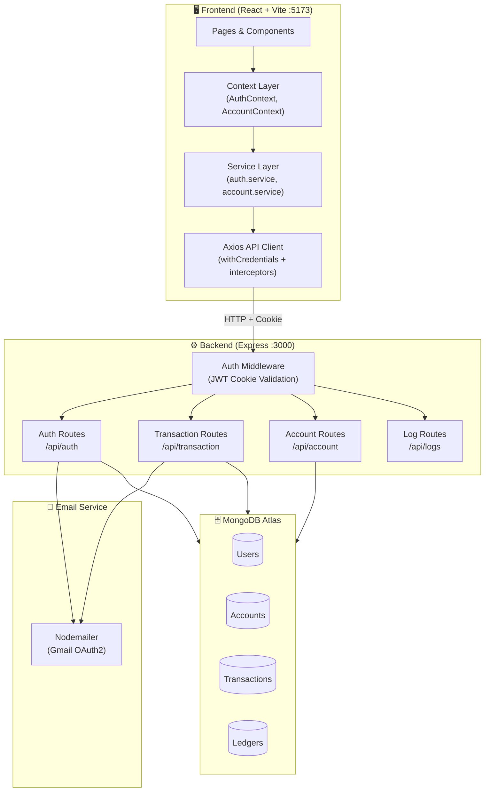
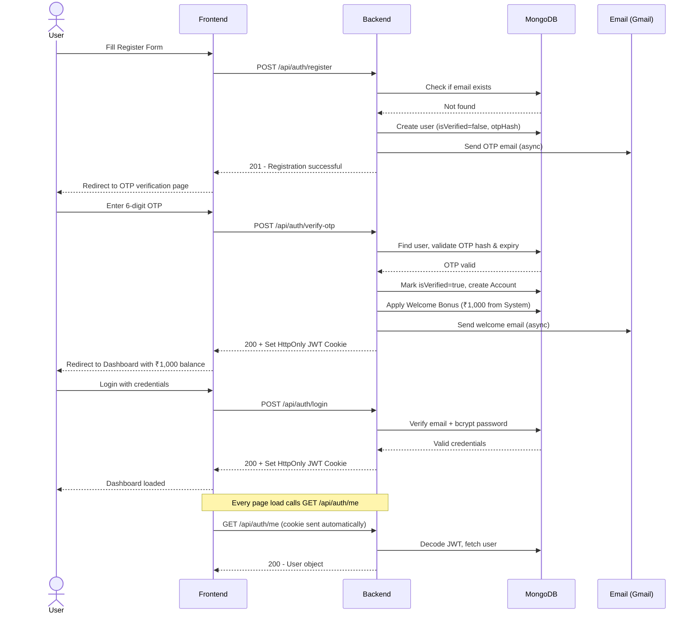
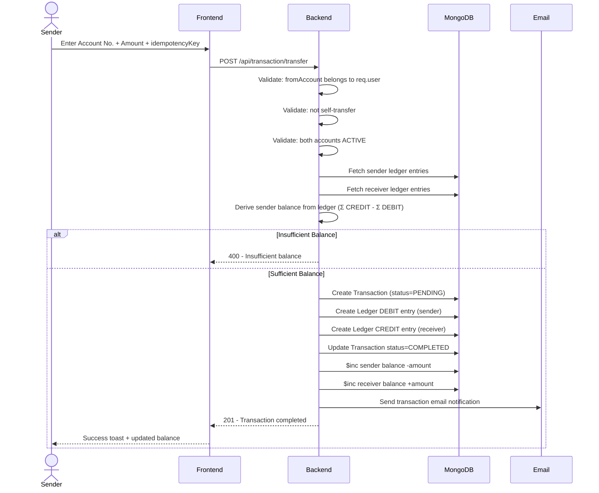
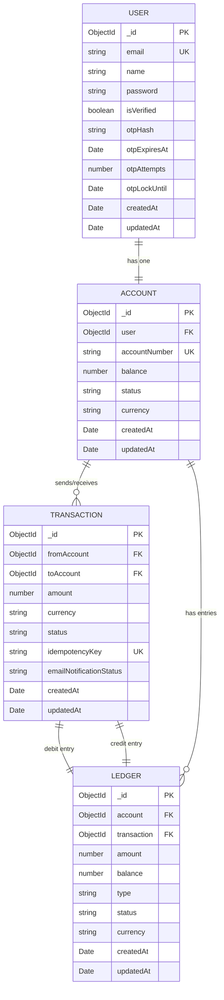
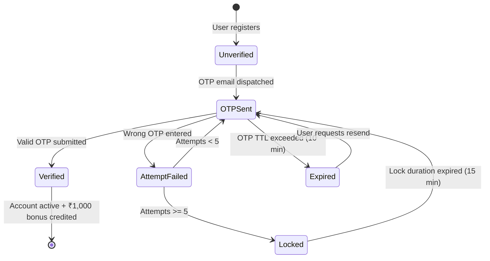

# 🏦 SecureBank — Full-Stack Fintech Banking App

> A production-grade, full-stack banking application with OTP-based authentication, double-entry ledger accounting, secure fund transfers, and real-time email notifications.


---

## 📋 Table of Contents

- [Overview](#overview)
- [Tech Stack](#tech-stack)
- [System Architecture](#system-architecture)
- [Authentication Flow](#authentication-flow)
- [Transfer Flow](#transfer-flow)
- [Database Schema](#database-schema)
- [API Reference](#api-reference)
- [Project Structure](#project-structure)
- [Getting Started](#getting-started)
- [Environment Variables](#environment-variables)
- [Security Features](#security-features)

---

## Overview

SecureBank is a full-stack fintech application that simulates a real banking system. Users register with email OTP verification, receive a ₹1,000 welcome bonus, and can securely transfer funds between accounts. Every transaction is recorded in a double-entry ledger for full auditability.

### Key Features
- 🔐 **OTP Email Verification** — secure sign-up with time-limited, hashed OTPs
- 💰 **Welcome Bonus** — ₹1,000 credited automatically on first verification
- 💸 **Fund Transfers** — idempotent, ledger-backed peer-to-peer transfers
- 📒 **Double-Entry Ledger** — every debit has a matching credit entry
- 📧 **Email Notifications** — transaction alerts via Nodemailer
- 🔒 **HttpOnly JWT Cookies** — session management with no localStorage exposure
- 🌙 **Theme Support** — light/dark mode switching
- 📱 **Responsive UI** — mobile-first design with Tailwind CSS

---

## Tech Stack

### Backend
| Layer | Technology |
|-------|-----------|
| Runtime | Node.js |
| Framework | Express.js v5 |
| Database | MongoDB Atlas (Mongoose v9) |
| Auth | JWT + HttpOnly Cookies |
| Email | Nodemailer (Gmail OAuth2) |
| Security | bcryptjs, cookie-parser, CORS |

### Frontend
| Layer | Technology |
|-------|-----------|
| Framework | React 19 |
| Build Tool | Vite 7 |
| Routing | React Router v6 |
| HTTP Client | Axios |
| Forms | React Hook Form + Zod |
| Styling | Tailwind CSS |
| Animations | Framer Motion |

---

## System Architecture



---

## Authentication Flow



---

## Transfer Flow



---

## Database Schema



---

## OTP State Machine



---

## API Reference

### Auth — `/api/auth`

| Method | Endpoint | Auth | Description |
|--------|----------|------|-------------|
| `POST` | `/register` | ❌ | Register new user, triggers OTP email |
| `POST` | `/verify-otp` | ❌ | Verify OTP, creates account + welcome bonus |
| `POST` | `/resend-otp` | ❌ | Resend OTP to email |
| `POST` | `/login` | ❌ | Login with email + password |
| `GET` | `/me` | ✅ | Get current authenticated user |
| `POST` | `/logout` | ✅ | Clear auth cookie, logout |

### Account — `/api/account`

| Method | Endpoint | Auth | Description |
|--------|----------|------|-------------|
| `GET` | `/me` | ✅ | Get current user's account details |
| `GET` | `/balance` | ✅ | Get current balance |
| `GET` | `/lookup` | ✅ | Lookup account by account number |

### Transaction — `/api/transaction`

| Method | Endpoint | Auth | Description |
|--------|----------|------|-------------|
| `POST` | `/transfer` | ✅ | Transfer funds between accounts |
| `GET` | `/history` | ✅ | Paginated transaction history with filters |
| `GET` | `/recent` | ✅ | Last N transactions |
| `GET` | `/detail/:transactionId` | ✅ | Full transaction detail with ledger entries |

### Logs — `/api/logs`

| Method | Endpoint | Auth | Description |
|--------|----------|------|-------------|
| `POST` | `/` | ❌ | Client-side log event |

---

//
## Project Structure

```
BANKING/
├── Backend/
│   ├── server.js                  # Entry point, starts Express + DB
│   ├── package.json
│   └── src/
│       ├── app.js                 # Express app, CORS, middleware
│       ├── config/
│       │   └── db.js              # Mongoose connection
│       ├── controllers/
│       │   ├── auth.controller.js
│       │   ├── account.controller.js
│       │   ├── transaction.controller.js
│       │   └── log.controller.js
│       ├── middleware/
│       │   └── auth.middleware.js # JWT cookie validation
│       ├── models/
│       │   ├── user.model.js
│       │   ├── account.model.js
│       │   ├── transaction.model.js
│       │   └── ledger.model.js
│       ├── routes/
│       │   ├── auth.route.js
│       │   ├── account.routes.js
│       │   ├── transaction.route.js
│       │   └── log.route.js
│       └── services/
│           └── email.service.js   # Nodemailer OTP + transaction emails
│
└── Frontend/
    ├── index.html
    ├── vite.config.js             # Vite + proxy to :3000
    ├── tailwind.config.js
    └── src/
        ├── main.jsx               # React root
        ├── app/
        │   ├── App.jsx            # Root component with providers
        │   └── router.jsx         # React Router route definitions
        ├── components/
        │   ├── layout/            # AppShell, ProtectedRoute, AuthLayout
        │   └── ui/                # Reusable UI components
        ├── context/
        │   ├── AuthContext.jsx    # Authentication state
        │   ├── AccountContext.jsx # Account + balance state
        │   └── ThemeContext.jsx   # Light/Dark theme
        ├── hooks/
        │   └── useAppInitialization.js
        ├── pages/
        │   ├── RegisterPage.jsx
        │   ├── VerifyOtpPage.jsx
        │   ├── LoginPage.jsx
        │   ├── DashboardPage.jsx
        │   ├── TransferPage.jsx
        │   └── TransactionsPage.jsx
        ├── services/
        │   ├── api.js             # Axios instance + interceptors
        │   ├── auth.service.js
        │   ├── account.service.js
        │   └── transaction.service.js
        └── utils/
            ├── validators.js
            ├── format.js
            └── date.js
```

---

## Getting Started

### Prerequisites
- Node.js >= 18
- MongoDB Atlas account (free M0 cluster works)
- Gmail account for email (with App Password or OAuth2)

### 1. Clone the repository

```bash
git clone https://github.com/Kadiwalhussain/backend.git
cd backend
```

### 2. Setup Backend

```bash
cd Backend
npm install
cp .env.example .env   # fill in your values
npm run dev            # starts on http://localhost:3000
```

### 3. Setup Frontend

```bash
cd Frontend
npm install
cp .env.example .env   # fill in your values
npm run dev            # starts on http://localhost:5173
```

Open [http://localhost:5173](http://localhost:5173) 🎉

---

## Environment Variables

### Backend — `Backend/.env`

```env
MONGO_URI=mongodb+srv://<user>:<password>@cluster0.xxxxx.mongodb.net/
JWT_SECRET=your_super_secret_jwt_key

# Gmail OAuth2 (for Nodemailer)
CLIENT_ID=your_google_oauth_client_id
CLIENT_SECRET=your_google_oauth_client_secret
REFRESH_TOKEN=your_google_oauth_refresh_token
EMAIL_USER=your_gmail@gmail.com

# Optional
SYSTEM_EMAIL=system@backend-ledger.local
NODE_ENV=development
```

### Frontend — `Frontend/.env`

```env
VITE_API_BASE_URL=/api
```

> The Vite dev server proxies `/api` → `http://localhost:3000` automatically.

---

## Security Features

| Feature | Implementation |
|---------|----------------|
| **Password Hashing** | `bcryptjs` with salt rounds = 10 |
| **JWT Storage** | HttpOnly cookie (not localStorage) |
| **OTP Security** | SHA-256 hashed, 10-min TTL, 5-attempt lockout |
| **CORS** | Strict origin whitelist + credentials |
| **Idempotency** | Unique key per transaction prevents double-spend |
| **Auth Middleware** | Every protected route validates JWT + DB user lookup |
| **Rate Limiting** | OTP locked for 15 min after 5 failed attempts |
| **Session Expiry** | JWT expires in 3 days, auto-logout on 401 |

---

## License

MIT © [Hussain Kadiwal](https://github.com/Kadiwalhussain)
